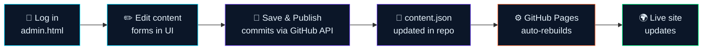

<div align="center">


# ✦ Rahul Dodke — Portfolio

**Data Science Analyst & Software Engineer**


**[🔗 Live Site](#)** · **[📘 Interactive Docs](./README.html)** · **[🐛 Report an Issue](../../issues)**

</div>

<br>

<details open>
<summary><b>📑 Table of Contents</b> <i>(click to collapse)</i></summary>
<br>

- [✨ What is this?](#-what-is-this)
- [🧩 How it works](#-how-it-works)
- [🚀 Quick Start](#-quick-start)
  - [1. Upload the files](#1-upload-the-files)
  - [2. Enable GitHub Pages](#2-enable-github-pages)
  - [3. Create a Personal Access Token](#3-create-a-personal-access-token)
  - [4. Connect the back office](#4-connect-the-back-office)
- [🔐 Back Office Access](#-back-office-access)
- [🛠️ Editing Content](#️-editing-content)
- [🩺 Troubleshooting](#-troubleshooting)
- [❓ FAQ](#-faq)
- [🧰 Tech Stack](#-tech-stack)
- [📄 License](#-license)

</details>

<br>

## ✨ What is this?

Most static portfolios mean editing HTML every time you want to update a project or job title. This setup splits the site into **content** and **presentation**:

<table>
<tr><th>File</th><th>Purpose</th></tr>
<tr><td><code>content.json</code></td><td>Every piece of text, link, project, and skill — your site's "database"</td></tr>
<tr><td><code>index.html</code></td><td>The public portfolio. Fetches <code>content.json</code> on load and renders the page from it. No hardcoded text.</td></tr>
<tr><td><code>admin.html</code></td><td>A password-protected back office. Loads the same <code>content.json</code> into editable forms, and publishes changes straight to this repo via the GitHub API.</td></tr>
<tr><td><code>favicon.svg</code></td><td>Browser tab icon</td></tr>
<tr><td><code>README.html</code></td><td>Interactive setup + usage docs (open it in a browser)</td></tr>
</table>

> [!TIP]
> Because GitHub Pages rebuilds automatically whenever a file in the repo changes, clicking **Publish** in the back office is all it takes to update the live site — usually within 30–90 seconds.

<br>

## 🧩 How it works



GitHub Pages only serves static files — there's no server to handle a "save" request. So the back office talks **directly to GitHub's REST API from your browser**, authenticated with a Personal Access Token (PAT) you generate once and store locally in your browser.

<br>

## 🚀 Quick Start

<details open>
<summary><b>1. Upload the files</b></summary>
<br>

Make sure these four files all sit together in the **root** of this repo:

```
your-repo/
├── index.html
├── admin.html
├── content.json
└── favicon.svg
```

</details>

<details>
<summary><b>2. Enable GitHub Pages</b></summary>
<br>

Repo → **Settings → Pages** → Source: **Deploy from a branch** → Branch: `main` → Folder: `/ (root)` → **Save**.

Your site will be live at:

```
https://<your-username>.github.io/<repo-name>/
```

</details>

<details>
<summary><b>3. Create a Personal Access Token</b></summary>
<br>

The back office needs write access to commit changes.

1. **GitHub → Settings → Developer settings → Personal access tokens → Fine-grained tokens → Generate new token**
2. Name it (e.g. `portfolio-admin`), set an expiry
3. **Repository access:** "Only select repositories" → choose this repo only
4. **Permissions → Repository permissions → Contents:** set to **`Read and write`**
5. Generate, and copy the token (`github_pat_...`) — GitHub shows it only once

> [!WARNING]
> Setting **Contents** to **Read and write** is the step people most often miss. Without it, publishing fails with:
> ```
> Publish failed: Resource not accessible by personal access token
> ```

</details>

<details>
<summary><b>4. Connect the back office</b></summary>
<br>

1. Open `admin.html` on your live site and log in
2. Sidebar → **⚙ GitHub Settings**
3. Fill in:

   | Field | Value |
   |---|---|
   | GitHub Repository | `username/repository-name` |
   | Branch | `main` |
   | content.json Path | `content.json` |
   | Token | the token from step 3 |

4. **Save Connection Settings** → **Test Connection** to confirm write access
5. Edit anything, then **🚀 Save & Publish**

</details>

📘 For the full walkthrough with diagrams, troubleshooting, and FAQ, open **[README.html](./README.html)** in a browser.

<br>

## 🔐 Back Office Access

The admin panel isn't linked anywhere on the public site.

<table>
<tr><th>Method</th><th>How</th></tr>
<tr><td>Direct URL</td><td><code>yoursite.com/admin.html</code></td></tr>
<tr><td>Hash redirect</td><td><code>yoursite.com/index.html#admin</code></td></tr>
<tr><td>Logo click</td><td>Click the site logo <b>5 times quickly</b></td></tr>
</table>

<details>
<summary>🔑 <b>Default login credentials</b> <i>(click to reveal)</i></summary>
<br>

```
Username: prakrit3625
Password: prakrit@3625
```

> [!NOTE]
> This login is a deterrent for casual visitors, not strong security. The real protection is that nobody else has your GitHub token, which lives only in your browser's local storage and is never transmitted anywhere except directly to GitHub's API.

</details>

<br>

## 🛠️ Editing Content

The back office sidebar mirrors the portfolio's sections:

<p>


</p>

Repeatable content (projects, experience entries, skills, social links) supports **add / reorder / remove**. Nothing touches the live site until you click **Save & Publish** — use **↻ Reload from GitHub** anytime to discard unsaved edits.

<br>

## 🩺 Troubleshooting

<details>
<summary><code>Resource not accessible by personal access token</code></summary>
<br>

**Cause:** Token lacks write access.
**Fix:** Regenerate the token with **Contents: Read and write** permission (see [step 3](#3-create-a-personal-access-token)). Permission edits on existing tokens don't always apply retroactively — regenerate rather than edit.

</details>

<details>
<summary><code>404</code> on connect / publish</summary>
<br>

**Cause:** Wrong repo name, branch, or file path.
**Fix:** Confirm the repository field is exactly `username/repo-name` (no URL, no trailing slash) and the branch matches your repo's actual default branch.

</details>

<details>
<summary><code>401</code> on connect / publish</summary>
<br>

**Cause:** Token expired or invalid.
**Fix:** Generate a new token and update it in **⚙ GitHub Settings**.

</details>

<details>
<summary>Changes published but the live site didn't update</summary>
<br>

**Cause:** GitHub Pages is still rebuilding.
**Fix:** Wait ~60 seconds, then hard-refresh (<kbd>Ctrl</kbd>/<kbd>Cmd</kbd> + <kbd>Shift</kbd> + <kbd>R</kbd>). Check build status under the repo's **Actions** tab.

</details>

<details>
<summary>Portfolio stuck on a loading screen</summary>
<br>

**Cause:** <code>content.json</code> isn't reachable.
**Fix:** Confirm it's uploaded in the same folder as <code>index.html</code> and the filename matches exactly (case-sensitive).

</details>

<br>

## ❓ FAQ

<details>
<summary>Do I need to know how to code to use this?</summary>
<br>
No. Initial setup involves copying a token from GitHub once, but day-to-day editing is entirely through the visual back office.
</details>

<details>
<summary>Can I edit from my phone?</summary>
<br>
Yes — both the portfolio and the back office are fully responsive.
</details>

<details>
<summary>What happens if my token expires?</summary>
<br>
Publishing fails with a 401 error. Generate a new token and paste it into GitHub Settings — your repo/branch/path settings stay saved.
</details>

<details>
<summary>Can someone else edit my site without permission?</summary>
<br>
They'd need the admin URL or logo-click trigger, then the login credentials, and even then couldn't publish without your personal GitHub token, which is stored locally in your browser only.
</details>

<details>
<summary>Does this cost anything?</summary>
<br>
No — GitHub Pages hosting and the GitHub API are free for public repositories.
</details>

<details>
<summary>Can I use a custom domain?</summary>
<br>
Yes — GitHub Pages supports custom domains under Settings → Pages → Custom domain. Everything else stays the same.
</details>

<br>

## 🧰 Tech Stack


No frameworks, no build step, no `node_modules` — just vanilla HTML/CSS/JS, GitHub Pages for free hosting, and the GitHub REST API's `contents` endpoint for publishing.

<br>

## 📄 License

MIT — feel free to fork and adapt for your own portfolio.

<br>

<div align="center">

**[⬆ Back to top](#-portfolio--back-office)**

</div>
